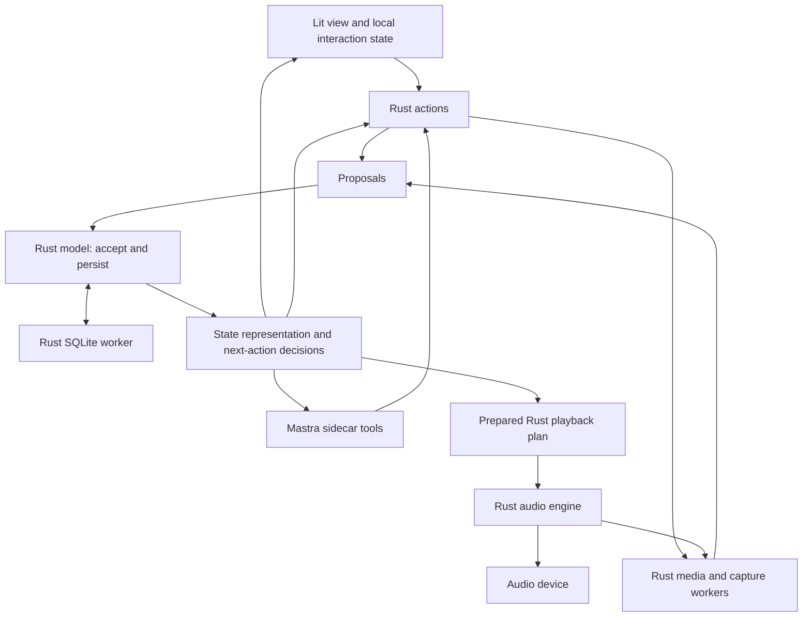

# Songwriter desktop port — Rust SAM core, Tauri and lit/TypeScript view

Status: D1 in progress, 2026-09-09. The first headless Rust SAM/SQLite slice is
implemented. Desktop shell, bindings, native audio/media, packaged Mastra and
cross-platform release evidence remain outstanding. See
[D1 validation](docs/DESKTOP_D1_VALIDATION.md). D1 is not complete.

This is the selected product direction for the next implementation workstream.
It supersedes the Neon/Vercel deployment target in MASTRA_AGENT_PLAN.md. Preserve
that prototype's useful editing/recovery work, but stop treating hosted sign-in,
Neon configuration or a production database as prerequisites for this app.
Phases 1–7 and the completed arrangement redesign remain the musical foundation.
Desktop phases below use D1–D7 to avoid confusing them with the existing roadmap.

The selected architecture moves the authoritative SAM (State–Action–Model) loop
and musical rules into Rust. Lit renders state representations and sends intents;
Mastra is another client of the same Rust action interface. This replaces the
earlier proposal to run the musical workspace in a TypeScript sidecar. The older
TypeScript implementation remains a migration reference, not the desktop authority.

## Product outcome and local login

Install Songwriter on Windows, macOS or Linux, open a local profile, and write
music immediately. Preserve the Ableton-inspired song arrangement and relative
1–7 note editor. Recording, playback, saving, recovery and export work offline.
The writer and agent edit the same composition through the same validated commands.

Default interpretation of local login: a local profile under the current OS user,
automatically reopened at launch. No email, verification link, OAuth callback,
remote account, subscription service or database provisioning. A separate app
password is an optional product decision; the planned default uses the OS login.

- A profile has a stable local ID, display name, preferences and its own data path.
  Ship one default profile first; expose create/switch profiles in D2.
- Profiles organize work; they are not security isolation between people sharing
  an OS account. Rely on OS account permissions and disk protection for that.
- Switching profiles stops transport/capture safely, checkpoints agent work,
  closes stores, clears credentials from memory and advances an execution epoch
  before opening the next profile. Late messages from the old epoch are rejected.
- A separate password, if selected, needs an explicit encryption/unlock design for
  data, recordings and backups. A password screen over readable files is not data
  protection. Password reset cannot imply recovery of an encrypted vault.
- Cloud agent reasoning requires the writer's own supported provider API key and
  internet access. Local login does not make a cloud model offline or free.
  Missing credentials disable agent reasoning without blocking music editing.
- A compatible local model endpoint is an optional subsequent provider adapter;
  do not bundle a large model or promise offline AI in the first desktop release.

## Stack decisions

| Area | Choice and reason |
| --- | --- |
| Desktop host | Tauri 2 with a Rust core; native window lifecycle, files, credentials, devices and audio. |
| UI | Existing Vite, TypeScript, lit-html and CSS. Preserve arrangement/relative-note editor, keyboard interactions and accessibility. |
| Musical semantics | Port the song model, exact time, validation, commands, history and analysis to Rust. Preserve behavior using differential fixtures against the existing TypeScript implementation. |
| Headless workspace | A Rust SAM module owns actions, proposal acceptance, canonical model, derived state representations and next-action decisions. UI and agent use the same interface through thin adapters. |
| Durable local data | Rust-owned SQLite transactions using a dedicated database worker, initially rusqlite. Store versioned song envelopes as JSON plus indexed identity/revision fields, operation receipts and task ledger. No generic SQL exposed to the UI or agent. |
| Native audio | Rust engine with CPAL device I/O; native synthesis/mixing, sample scheduling, decoding, capture and waveform work. Codec stack is selected by the D1 compatibility spike. |
| Agent | Keep Mastra in an on-demand bundled Node sidecar that calls Rust actions and reads Rust state representations. Use local file-backed @mastra/libsql for SDK memory/snapshots and the Rust-owned SQLite ledger for task/effect authority. No Postgres server. |
| Secrets | Rust credential module using OS credential storage, evaluated via keyring. If unavailable, offer session-only credentials; never silently save plaintext keys. |
| Packaging | Tauri installers plus a pinned, bundled Node runtime, bundled JS and required native dependencies for each supported target. No user-installed Node/Bun/Rust requirement. |

The Node sidecar is a deliberate cost of retaining Mastra. Launch it when agent
work requires it; ordinary editing, saving, playback and recording work with it
stopped, unavailable or crashed. It owns no authoritative musical state or rules.
Tauri's small shell does not imply a tiny total installer once Node and codecs
are included. D1 measures the actual artifact and proves packaging before a
large port. Do not assume a development script or a single-file JS build can
package Mastra and libSQL's native dependencies on every OS.

## Module interfaces and ownership



The diagram shows logical calls. All Node/Rust messages go through the host's
private process channel. The renderer does not receive a general shell, SQL
connection, raw filesystem interface, provider credentials or agent process handle.

### Rust SAM workspace module

Expose a small interface for opening/reading a song, dispatching a named action,
reading an operation receipt and subscribing to state representations. Both UI and
agent cross this seam. Keep the core independent of Tauri so tests can exercise
the same interface without a webview. Tauri and Mastra transport adapters supply
trusted session context; neither contains musical acceptance rules.

- **Actions** turn input into proposals. They may arrange work through storage,
  media or analysis adapters, but cannot directly mutate the model. The external
  interface accepts scoped intents such as move-note or change-meter, not arbitrary
  memory patches, prevalidated song replacements or SQL. Imports are validated
  actions too. Mastra chooses which actions to request; it does not own acceptors.
- **Model** is the sole authority for accepting proposals and changing song and
  application state. Rust acceptors enforce exact time, relative pitch, membership,
  voice identity, revision checks and operation identity. Atomic musical edits are
  accepted completely or rejected; partial task progress consists of separate
  accepted actions. Reactors maintain dependent model values within the same
  serialized step; they do not bypass validation or perform blocking side effects.
- **State** derives read-only representations and evaluates next-action predicates
  from the accepted model. The representations serve the view and bounded agent
  context. Next-action decisions schedule explicit actions after the current step;
  they never recursively mutate the model. Bound automatic chains, track their
  cause/generation and suppress duplicates. These govern application lifecycle;
  musical choices remain with the writer or agent.
- **View** renders those representations. Keep selection, hover, focus, zoom,
  scroll, unsubmitted text and temporary drag previews in TypeScript. These are
  presentation state, not a second canonical song or musical validator. On commit,
  Rust accepts/rejects the intent and the view reconciles its preview to that result.
  Selecting context for an agent sends IDs plus revision/profile epoch.

Desktop mutation sequence:

1. Host derives profile/workspace identity from its session, validates the action
   message and tags its source. Never trust arbitrary paths/profile IDs from clients.
2. Rust actions compute proposals; asynchronous work carries the originating
   revision, operation ID and execution generation. Its completion re-enters the
   model as a proposal, checked against current state rather than an old snapshot.
3. A serialized model step validates the proposal and computes the candidate model,
   history and receipt without publishing changes. A duplicate operation returns
   its recorded result; a reused ID with different input fails.
4. For durable edits, a single SQLite transaction compares the stored revision and
   saves the candidate envelope, history/receipt and associated agent result. On
   failure, keep the prior authoritative model. After success, install the candidate;
   if the process dies in between, restart from the committed database. Do not hold
   a model mutex across I/O, and do not accept intervening conflicting transitions
   while an ordered durable commit is pending.
5. Derive and publish the state representation, then schedule any next actions.
   A notification/render failure cannot turn a saved success into a failed receipt.
   Playback synchronization has separate status: failure to update audio cannot
   silently undo durable music. Transient transport/meter updates do not write a
   song revision or undo entry for every frame.

The Rust host is the sole workspace SQLite writer. Use one application owner per
profile, with additional windows routed to it. Model network requests and expensive
analysis run outside model steps; completions are revision-checked proposals.

Define versioned action/state contracts in Rust and generate TypeScript bindings;
keep runtime validation on both process inputs despite static types. Use bounded
state snapshots and ordered revisioned updates, with resnapshot on reconnect or a
sequence gap. Never send the full song for every meter tick or pointer move. Specify
JSON-safe exact rational encoding and numeric limits so JavaScript cannot round
Rust integers silently. Keep existing song JSON compatibility distinct from the
internal representation and IPC version.

### Audio module

Expose prepare/replace-plan, play, pause/stop, seek, audition, device selection and
status subscription. Recording and media operations have their own lifecycle
interface. CPAL provides I/O, not a complete instrument/recording implementation.

- The Rust musical compiler resolves sections, pattern repetitions, chord members,
  voices, fretted realizations and relative pitches into a versioned playback
  plan. Preserve exact rational musical times; samples/Hz are derived values.
- The native preparation worker turns that plan into bounded device-frame events
  and prepares decoded media. The device's sample clock drives execution.
- Rust receives a complete bounded song schedule before playback in the first
  version. Reject an over-limit plan visibly; never require a JS timer per note.
  Future streaming schedules must have native lookahead and starvation handling.
- Convert absolute musical times to sample positions with a documented rounding
  rule. Avoid accumulated rounding drift in tuplets, repeated cycles and loops.
  Check numeric ranges off the audio thread. The existing schema has a global
  tempo/beat unit; a tempo-map feature is a separate musical extension.
- No allocation, blocking locks, JSON parsing, disk/network I/O, logging or agent
  work in the audio callback. Use bounded queues and prepared buffers. Never
  destroy large plans or free sample buffers on the audio thread.
- The SAM loop, its model, acceptance and state derivation never execute on the
  audio callback. Audio consumes prepared immutable schedules and bounded control
  messages; status returns through throttled events. It never locks the song model.
- Give stop/seek/generation changes priority. Define queue overflow and overload
  behavior; report dropouts rather than hiding them. A stalled UI must not stall
  audio callbacks or recording writes.
- Publish timestamped engine position at a modest rate and interpolate the visual
  playhead with animation frames. UI animation does not determine musical timing.
- Preserve initial edit-during-playback behavior by stopping and rebuilding the
  plan. Seamless live replacement, if implemented later, needs explicit rules
  for sustaining/retriggering voices and applying tempo/tonic changes.
- Native MIDI input, when added, goes directly to the engine. Webview keyboard
  input still includes UI/IPC latency and must be measured honestly.

### Process and failure interface

Version all messages and bind them to profile epoch, workspace/task identity,
request ID and execution generation. Use a bounded framed channel over inherited
pipes, with explicit responses, events, timeouts and backpressure. Keep diagnostics
on stderr. Refuse incompatible sidecar/host versions; no public localhost server.

A crashed Mastra sidecar interrupts agent work only. Rust continues accepting
manual edits, saving, playback and recording. Restart the matching agent sidecar,
reload SDK snapshots and reconcile Rust task receipts before resuming agent work.
No invisible endlessly restarting loop. A renderer reload resubscribes to current
Rust state. A Rust host crash requires application restart and durable workspace/
capture recovery; no claim that audio survives that crash. Closing the last window
quits by default: stop audio, finalize capture and checkpoint work. No promise that agents continue
after app exit or the machine sleeps. Resume interrupted tasks explicitly.

## Storage, media and browser migration

Proposed per-profile layout under the OS application-data directory:

```text
profiles/<profile_id>/
  workspace.sqlite     # songs, revisions, history, receipts, task ledger, settings
  agent.sqlite         # SDK memory and snapshots; SDK is the only writer
  assets/<sha256>       # immutable original audio
  captures/<capture_id>/
  backups/
```

Provider keys live in OS credential storage, outside this directory. Exports and
ordinary backups omit credentials; conversation export is an explicit option.
JSON remains the portable composition format. SQLite is its transactional local
container, not a reason to remodel every chord and note into SQL tables.

Two SQLite files do not share a transaction. The app-owned task ledger and musical
receipt are authoritative. Persist the command identity before executing it;
record the successful musical change and result atomically in workspace.sqlite.
If Mastra's SDK snapshot lags, replay the recorded result or start a fresh segment
with current context. Never replay a mutation merely because agent.sqlite lost
its latest snapshot. Preserve bounded retries, explicit completion, cancellation,
partial progress, review/undo and stale-generation rejection.

For media, stage and flush the binary first, then attach its hash/metadata through
an atomic musical command. Retain staged files after an interrupted attachment.
Record to recoverable chunks through a worker, with sample counts and durable
capture metadata. Only mark a take ready after finalization/validation. Disk-full,
device loss or queue overflow leaves an explicit incomplete capture. Asset GC
must account for undo history, deleted songs, captures and in-flight operations.

The desktop app cannot directly open a browser origin's IndexedDB. Migration is
an explicit export/import from the browser that currently owns the songs:

- Existing .song.json and complete media bundles remain accepted.
- Add a versioned migration archive if existing exports omit undo history or
  recoverable captures. Include song IDs, revisions, history/receipts, guidance,
  asset originals, hashes and a manifest. Preserve originals and report omissions.
- Export unfinished hosted agent work as inspectable history/proposals, not as an
  automatically resumed desktop task with stale remote identity/credentials.
- Validate the entire archive and stage assets before promotion. Handle existing
  song IDs by explicit update-or-copy, with recoverable retries. Never overwrite
  a different song or declare success with missing/corrupt media.
- Prove current browser recording formats: WebM/Opus, Ogg/Opus and MP4/AAC as
  applicable. Do not assume a Rust decoder supports everything MediaRecorder made.
  Keep original bytes even when generating normalized PCM caches.
- Database backup must use a consistent SQLite snapshot/backup mechanism, not
  copy a live .sqlite file while ignoring its WAL. Back up referenced immutable
  assets with a manifest; test restore, migrations and rollback compatibility.

## Agent credentials, scope and local execution

Keep Mastra's loop in JavaScript. Tauri does not execute a Node SDK inside Rust.
Replace server HTTP/session middleware with the desktop profile/execution epoch,
and replace hosted browser delivery with the shared Rust SAM action/state interface.
Tool implementations are thin clients: Rust performs musical analysis, validation,
acceptance and persistence. Mastra handles model reasoning and task orchestration.
Its local state cannot override a Rust receipt, revision or cancellation generation.
Reuse recovery invariants from the hosted prototype, not its Neon deployment gate.

The user selects a supported cloud model/provider and enters their own key in
settings. Rust saves it in credential storage and passes it only to the packaged
agent module over the private channel when needed. Do not inherit the developer's
Vercel OIDC token or bake a shared provider/Neon key into the installer. Show the
selected provider, connectivity, model and local budget; local budgets are user
controls, not tamper-proof server billing enforcement. Redact keys from logs.

Agent tools use scoped project/entity/media handles and the same commands as the
UI. Preserve primitive CRUD, schema discovery, bounded search/read, analysis,
writing preferences, task checkpoints, completion and questions. Cover the full
existing local catalog in docs/CAPABILITIES.md; the hosted prototype's four-tool
subset is not sufficient desktop parity. A permission-dependent operation such
as microphone capture reports its actual state and cannot bypass OS consent.

Song content reaches a cloud provider only through requested agent work; ordinary
editing and audio never require model access. Binary audio upload is an explicit
operation, not an automatic consequence of including a take in context. Model
instructions cannot grant filesystem access or broaden the selected profile.

## Delivery phases

| Phase | Outcome | Exit evidence |
| --- | --- | --- |
| D1 — Prove the packaged foundation | Existing editor shell in Tauri, local profile, a thin Rust SAM editing slice, native audio and an independent Mastra client. | Packaged smoke tests, TypeScript/Rust behavior comparisons, durable recovery and agent-off editing. |
| D2 — Rust musical workspace and migration | Complete Rust model/actions/state/analysis, SQLite/profile persistence, portable import/export, history and recovery. | Musical parity against TypeScript, browser-to-desktop round trip, conflicts, restart/restore and profile fencing. |
| D3 — Native instrumental playback | Full current guitar/bass/drum audition, exact schedules, metronome, device controls and transport. | Shared musical fixtures, deterministic offline renders and real-device timing/dropout tests. |
| D4 — Native recording and media | Rust capture, durable takes, decoding, waveform caches and complete media bundles. | Permissions, interruption/disk-full recovery and browser codec compatibility on supported OSes. |
| D5 — Complete local agent workflow | BYOK setup, full catalog parity, task review, checkpoints/questions and restart recovery. | Real-model math-rock edit plus fault-injected concurrent edits, cancellation, profile switch and restart. |
| D6 — Desktop responsiveness and lifecycle | Large-song editing, accessibility, keyboard behavior, suspend/resume and stable UI/engine synchronization. | Profiled reference/stress projects, native UI/device checks and no audio loss under UI stalls. |
| D7 — Ship and retire hosted dependencies | Signed installers, update/recovery path and documented migration; desktop runs without Neon/Vercel. | Clean-machine installs, offline cold launch, update/restore matrix and target-specific release evidence. |

Sequence D1 → D2 → D3 → D4 → D5 → D6 → D7. The D1 agent proof happens early so
packaging is not discovered to be infeasible after the audio rewrite. D3/D4 design
must include their agent controls, even though the full user workflow closes in D5.
Each phase gets detailed implementation tasks before it starts; no phase is done
because its UI renders or its build compiles.

### D1 — Detailed foundation and feasibility gate

First implementation slice: the Rust core and SQLite adapter portions of steps 3
and 5, with a disposable fixture runner and TypeScript comparison fixtures. This
slice starts before the shell because it can be checked independently. It does
not satisfy the full steps' view/IPC requirements or the D1 acceptance gate.

**Purpose:** prove one thin path through the intended production architecture,
using disposable fixtures and a local profile. Keep the old web implementation
available while this is evaluated.

1. **Freeze the baseline and target matrix.** Record the current 94 unit, 12
   hosted integration and 38 browser tests as historical baseline, rerun relevant
   checks, and inventory every existing capability. Start with Windows x64,
   macOS arm64 and Linux x64. Decide exact minimum OS versions from the tested
   WebView, Node and audio dependencies. macOS Intel is an additional explicit
   build target, not an assumed property of the arm64 binary.
2. **Create the shell and lifecycle.** Add src-tauri, a pinned Rust toolchain and
   desktop build scripts. Load packaged local Vite assets with minimal Tauri
   capabilities. Create a default profile without network calls. Establish one
   application owner, useful startup failures and deterministic shutdown.
3. **Prove the Rust SAM seam with real music.** Add a Tauri-independent Rust core
   with actions, acceptors, model, state representations and bounded next-action
   handling. Port only the model subset needed for a disposable mixed-meter fixture:
   exact rational time, relative notes and chord membership, rename and move-note,
   validation, revisions and undo. Compare accepted and rejected edits against
   TypeScript fixtures, including an exact tuplet position and stale revision.
   Generate the first TypeScript action/state bindings and replace Controller's
   authority for this slice with a view adapter. Prove a local drag preview reconciles
   after acceptance or rejection. Keep the old browser as the separate reference;
   unsupported desktop actions must be visibly unavailable, never routed to a
   second TypeScript model. Full model/import support belongs to D2.
4. **Prove packaged Node and local SDK persistence.** Bundle a pinned Node runtime,
   Mastra and its Rust tool adapter, plus local libSQL dependencies. Launch on
   demand from Rust through private pipes with a version/profile handshake. Test a
   Mastra tool suspension, process termination and continuation from a file-backed
   SDK store. The package must run without development runtimes in PATH.
5. **Prove the atomic SAM path.** Create a small workspace.sqlite using a
   versioned migration. UI intent → Rust action/proposal → model acceptance and
   atomic commit → state representation → Lit render. Kill the Rust host after
   commit but before acknowledgement, reopen and retry the operation: exactly one
   edit and history entry must exist. Also test a failed save, duplicate agent
   delivery, a reused ID with different input and a missed state update followed
   by resnapshot. Undo after reopening restores the original music/title. No UI
   or agent caller can submit preaccepted state or bypass the Rust acceptor.
6. **Prove native audio independence.** Rust plays a simple metronome and pitched
   fixture from a prepared schedule, while the webview is intentionally stalled.
   Test stop/generation replacement, device enumeration and an unavailable-device
   error. Record timing evidence; no Web Audio fallback in this desktop proof.
7. **Prove media compatibility before choosing decoders.** Use real export fixtures
   from the existing recorder. Select and pin a native decoder stack that covers
   the required formats; identify any external binaries, native bindings, size and
   license/distribution obligations. Test a short native capture and recovery.
   Unsupported input must remain intact with a visible explanation.
8. **Join the vertical slice.** In the packaged app, use a configured test model
   to inspect and rename the fixture through the same command interface, verify
   completion, restart and undo. Use fake-model faults separately to prove
   duplicate delivery, stale revisions and sidecar crashes. Launch with the sidecar
   disabled and kill it during a task; manual editing, saving and playback must
   remain usable. Demonstrate the same with missing credentials and network loss.
9. **Record the measured decision.** Keep results in docs/DESKTOP_D1_VALIDATION.md:
   actual binaries/OS versions, cold launch, idle memory, installer size, tests,
   device configuration, audio behavior and unresolved gaps. If packaging or
   callback reliability fails, revise this architecture before expanding the port.

**D1 acceptance:** successful packaged launch on all declared targets; demonstrated
Rust/TypeScript parity for the selected musical slice, local save/restart/undo,
state resubscription and SDK process recovery; manual operations with no running
sidecar; native audio proof on real devices
with explicit platform coverage; no hosted auth/database calls; no embedded
credentials. A Linux droplet build cannot prove macOS/Windows microphone behavior.
Document blocked platform evidence instead of marking an untested target complete.

### Later phase implementation requirements

**D2:** port the complete existing musical model, commands, acceptance rules,
history, analysis and derived editor/agent representations to the Rust SAM core.
Finish song/settings/history/receipt persistence, local profile create/switch,
asset staging, consistent backups and migration archives. Rewire all desktop
editor actions to Rust and remove their TypeScript domain implementation from the
desktop runtime. Compare command sequences, rejected inputs, resulting documents,
undo/conflicts and analysis against TypeScript fixtures before each cutover.
Test failed DB migrations, read-only/full disks, duplicate imports and stale
profile processes. Preserve schema 7 semantics; envelope/archive versions can
evolve independently. Playback/capture workers close in D3/D4; their document
semantics and lifecycle interfaces belong in this model inventory.

**D3:** port every current audible feature and its expression semantics. Exact
fixture comparisons cover odd/additive meters, tuplets, independent pattern
cycles, overlapping chord members, pedal voices, seek/loop, articulation, tonic
and global tempo changes. Visual meters are throttled. Record backend/device
limitations; native code alone does not establish a latency guarantee.

**D4:** move desktop recording, decode/playback, take trimming/placement and
waveforms off browser media APIs. Deal explicitly with separate input/output
sample clocks, drift/resampling, timestamp alignment, device changes and sleep.
Monitoring defaults off to avoid accidental feedback; latency calibration and
hardware monitoring guidance must match what the implementation supports.

**D5:** close every existing capability row, including recoverable captures,
agent prompts/preferences and task work items. Bind tools to the same Rust actions
and state queries used by the UI; do not port musical decisions back into tool
adapters. Keep provider work outside SAM steps so a slow network call cannot
block manual edits. Test actual local-file SDK recovery rather than assuming the
Postgres proof transfers. Preserve budget accounting and bound provider retries.

**D6:** use a reference project of 32 parts / 1,024 mixed-meter bars / 10,000 events
and a 50,000-event stress project, with representative chords and recorded takes.
Target smooth 60 Hz interaction on named hardware (p95 frame time ≤16.7 ms during
specified scrolling/dragging), ordinary input-to-feedback p95 <50 ms, and no
app-induced audio underruns in a 30-minute reference run. Measure these targets;
report stress degradation honestly. Target 48 kHz / 256-frame audio where supported,
try 128 frames on qualified devices, and record measured round-trip latency rather
than equating buffer duration with it. Virtualize dense views, use Canvas where
profiling justifies it, and keep ordinary controls accessible DOM. Test keyboard,
IME, focus, scaling, screen readers and graphics/device differences per platform.

**D7:** pin/rebuild native dependencies per target, include their notices, sign
and notarize the relevant packages, and sign update artifacts. Verify updater
interruption and an application downgrade with incompatible DB schema: restore a
compatible backup or refuse safely. Test installation on machines without Node,
Rust or Bun and first launch with networking disabled. Record actual OS/device
coverage. Installer signing credentials are release configuration, never source.

## Repository changes and transition

Start desktop work in its own branch. The unmerged hosted PR #11 is a source of
reusable prototype modules, not a required production rollout. Extract/cherry-pick
reviewed changes needed for desktop; do not merge the hosted activation unchanged.
Keep docs/CAPABILITIES.md and each phase's validation evidence current.

Likely locations (create only when a phase needs them):

- src/song/ — existing TypeScript behavior reference and legacy browser model
  during migration; excluded from desktop domain execution after D2.
- src/platform/browser/ — legacy browser adapter for comparison and existing tests.
- src/platform/desktop/ — thin action/state client and presentation adapter.
- src/generated/ — generated TypeScript wire contracts from Rust definitions.
- desktop/agent/ — bundled Node entry, Mastra loop and Rust action/state tool client.
- src-tauri/crates/song-core/ — headless Rust musical model, SAM actions/acceptors/
  reactors/state, exact time, history and analysis, independent of Tauri and devices.
- src-tauri/src/ — application/profile owner, SAM execution and effect adapters,
  private IPC, SQLite worker, media and credential modules.
- src-tauri/crates/audio-engine/ — independently testable preparation, scheduling
  and DSP; audio callbacks have no dependency on the SAM execution loop.
- tests/desktop/ — protocol, packaged-app, migration and recovery coverage.

Keep browser development and existing tests during the port; do not add unrelated
web features or a second new frontend framework. The legacy browser remains a
separate reference during migration, not an alternative authority in the desktop
app. Future browser parity through Rust/WASM or a remote Rust host is a separate
decision, not required by this desktop plan. At D7 remove Neon Auth, hosted
API routes, @mastra/pg and Vercel-runtime assumptions from the desktop distribution.
Retire live preview resources separately after confirming there is nothing to
retain. This planning task does not delete databases, revoke credentials, close
PRs or change the current website. Download/update hosting can remain static;
it is not a runtime dependency for opening or editing music.

## Validation strategy and plan review

Use the existing TypeScript musical implementation and tests as the migration
reference. Run matching fixtures/action sequences through TypeScript and Rust,
normalizing only incidental IDs/timestamps, and compare results, errors, exact
times, history and analysis. Document any intended semantic change separately;
do not excuse a mismatch as a language difference. Cover rational overflow and
serialization, schema defaults and migrations, stable IDs and imported history.
Test UI and Mastra adapters against the same Rust SAM interface and ensure neither
can bypass acceptors. Verify stale asynchronous proposals, bounded next actions,
failed commits, receipt replay, agent-off operation and view resubscription.
Add Rust tests and deterministic offline audio renders for scheduling/DSP, then
real-device latency/recording evidence. Retain legacy browser tests while replacing browser
APIs incrementally. Tauri native-window tests are additional evidence: Playwright
against Vite alone is not a packaged desktop test. Current Tauri WebDriver support
has a macOS gap; use a documented alternative/manual native checklist there.

Before publication: frozen dependency installs, applicable TypeScript checks and
tests, cargo fmt/clippy/test for new crates, platform builds, relevant browser and
packaged tests, and git diff --check. Do not run the old hosted Postgres suite as
a desktop prerequisite after its adapter is deliberately retired; preserve its
behavioral coverage in local-store tests. Do not remove coverage just to pass.

Planning review, 2026-09-09:

- Pass 1 — ownership: Rust owns SAM, musical validation and workspace persistence;
  Lit and the packaged Mastra sidecar are clients. Node starts on demand and is
  absent from the manual editing/audio path. One authoritative desktop model.
- Pass 2 — durability: addressed two-database crash windows, atomic edit/receipt
  commits, profile fencing, migration history, original codecs and live WAL backups.
- Pass 3 — realism: moved SDK/codec packaging into D1, separated native audio from
  UI claims, defined measurable performance targets and real-device release gates.
  Clarified local-profile security and the remaining need for model credentials.
- Pass 4 — SAM revision: replaced the TypeScript workspace proposal throughout the
  architecture, failure model, repository layout and D1/D2 tasks. Added differential
  musical migration checks, generated contracts, revisioned view resubscription,
  local preview reconciliation and bounded next-action handling. Kept all SAM work
  off the audio callback and made agent-sidecar failure independent of manual work.

Open implementation discoveries belong in D1: exact OS floors/dependency versions,
codec packaging and measured footprint/performance. They do not reopen the selected
local-first architecture or reinstate Neon login. An optional app password remains
a product preference, not a prerequisite for the default local profile.

## Primary references checked for this plan

- [SAM pattern](https://sam.js.org/): actions propose, the model accepts and state
  derives representations and next-action decisions; the pattern is independent
  of its JavaScript implementations. This plan implements the desktop loop in Rust.
- [Tauri process model](https://tauri.app/concept/process-model/) and
  [IPC](https://tauri.app/concept/inter-process-communication/): Rust/webview process
  separation and asynchronous command transport, not an audio timing channel.
- [Tauri sidecars](https://tauri.app/develop/sidecar/): external binaries packaged
  per target; this enables but does not prove our Node/Mastra distribution.
- [Tauri capabilities](https://tauri.app/security/capabilities/): restrict which
  privileged commands each window can invoke.
- [CPAL](https://docs.rs/cpal/latest/cpal/): native audio device streams/callbacks;
  sequencing, instruments, recording durability and codec coverage remain our work.
- [Mastra libSQL](https://mastra.ai/integrations/databases/libsql): local file-backed
  SDK storage, with actual suspension compatibility to be demonstrated in D1.
- [Rust keyring](https://docs.rs/keyring/latest/keyring/): credential-store adapter
  candidate; platform/backend availability must be verified in packaged builds.
- [SQLite backup](https://sqlite.org/backup.html): consistent database snapshots.
- [Tauri distribution](https://tauri.app/distribute/) and
  [native WebDriver tests](https://tauri.app/develop/tests/webdriver/): packaging,
  platform signing and test-platform limitations.
