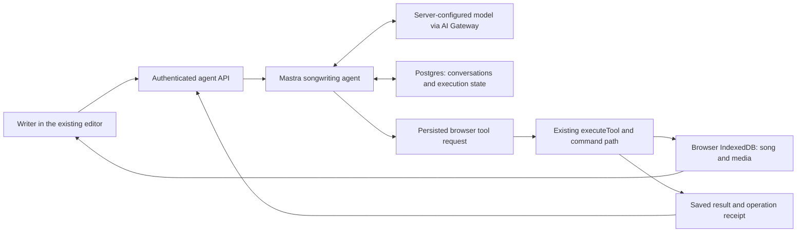

# Built-in songwriting agent with Mastra

Status: planning only. Requested 2026-09-08. No implementation, dependency
installation, provider provisioning or production changes are included in this
planning task. This is the next proposed agent workstream, separate from the
remaining mobile/offline work and Phase 9 song sync.

## Outcome

Open the deployed app, describe a musical change, and watch the agent make it.
No terminal, locally running bridge or external coding-agent session is required.
Keep the current arrangement workspace and relative 1–7 note editor.

Example: “Make a shorter reply to this guitar riff in 7/8. Keep the bass and its
sustained notes unchanged. Try a different chord ending.” The assistant reads the
actual music, makes an independent variation, checks the result, and explains
what changed. The writer can keep editing and undo individual changes.

## Current foundation

- `src/agent/tools.ts` already exposes musical operations through `executeTool`.
- `src/agent/context.ts` supplies bounded summaries, selection and revision data.
- `src/song/commands.ts` and `src/storage/projects.ts` validate and save edits,
  with revisions, operation receipts and conflict-aware undo.
- `src/agent/connection.ts` currently polls a loopback-only Bun bridge.
- `server/task-store.ts` persists external-agent tasks to `.agent/tasks.json`.
  It has useful task semantics but is not a hosted, multi-user database.
- The Agent panel already has requests, task progress, guidance, review and undo.
- The Vercel deployment currently serves the browser editor. Songs and recordings
  live in that browser's IndexedDB; the deployed app has no agent backend.
- The recent missing-checkpoint crash demonstrated that network payloads need
  runtime validation and compatibility handling before becoming render state.

## Architecture decision

Use Mastra for model/tool orchestration and persistent agent conversation state.
The browser remains the authority for musical edits and local media. Introduce
an authenticated server API under `/api/agent` in the same Vercel project.

### What we keep and what we add

| Keep | Add |
| --- | --- |
| Vite, TypeScript, Bun toolchain and lit-html | Mastra core on the server |
| Relative pitches, chords, exact rational timing and musical validation | Model-compatible tool schemas backed by existing commands |
| IndexedDB song/media persistence and undo | Durable hosted task and conversation storage |
| Arrangement, note editor and existing Agent panel | Streaming responses and automatic agent execution |
| Project guidance and reusable prompts | Authentication, per-user ownership and bounded model usage |

Use one songwriting agent first. It chooses atomic tools to pursue the writer's
request. Deterministic code continues to perform meter calculations, chord
membership changes, validation and saving. Do not create a second musical model
inside Mastra or a separate “AI edit” implementation.

### Hosting and proposed service choices

- Existing Vercel project: static Vite frontend plus explicit Node.js 24 API
  handlers importing Mastra core. No React/Next.js rewrite is required.
- Supabase Auth plus its managed Postgres is the proposed identity/storage
  combination. Start with owner/invite-only agent access; manual editing remains
  available without sign-in. This requires provisioning during implementation.
- Configure Mastra's Postgres adapter and conversation memory. Use separate
  application tables for ownership, pending browser commands and delivery receipts.
- Use Vercel AI Gateway with one server-selected, tool-capable model. Configure
  the model ID and credentials on the server. Select and record the launch model
  using the musical acceptance tasks below; never let a browser request pick an
  arbitrary model or provider URL.
- Pin compatible Mastra packages and schema-library versions at implementation.
  Preserve Bun 1.4.2 and frozen installs; Vercel's default Bun was too old for this
  repository's lockfile during deployment.
- Keep the old CLI bridge as an explicit development option during rollout. The
  hosted app selects the new connection deliberately; it never silently falls
  back to someone else's local bridge.

Mastra supports server integration, tools and persistent storage. The exact
Node/Vercel packaging and cold-start resume behaviour must pass an early deployed
proof before building the rest of the UI. References are listed below.

## Request and editing flow

1. A signed-in writer sends a request with the current song binding, selection,
   revision and a snapshot of project instructions/preferences.
2. The server authenticates the writer, creates an idempotent task, records its
   prompt/model/tool versions and starts a bounded Mastra run.
3. Mastra requests the context or musical operation it needs. Browser operations
   execute only through the established tool and command interface.
4. An edit carries a stable operation ID and expected revision. The browser
   validates and saves it, updates the arrangement, and returns its receipt.
5. The agent reads the outcome, fixes rejected requests where appropriate, and
   continues until it has fulfilled the objective or explicitly pauses.
6. The panel shows the result, changed objects and existing undo controls.

Keep full create/read/update/delete and composed outcomes available for all
current entities. Expand `docs/CAPABILITIES.md` to map UI outcome → tool → execution
location → browser requirements. Do not replace the tool surface with a single
“write a song” endpoint.

## Durable browser handoff (revision 1)

Use Mastra's explicit tool suspension/resume as the proposed boundary. Server
wrappers describe the existing tools; for browser work they suspend with an
immutable command envelope instead of executing a browser API on the server.
The browser executes the command and posts its validated result; the next HTTP
request resumes the saved Mastra run. Normal tool handoffs resume automatically
while the editor is connected. They are not approval prompts.

This is an application design using Mastra's suspension API, not a claim that
`clientTools` alone supplies durable delivery. M1 must prove the exact behaviour
with the pinned SDK, including termination of the suspended response and resume
on a freshly constructed Mastra instance. Keep the integration behind a small
adapter so SDK events never become unvalidated application state.

### Durable identities and state

Each task binds owner ID, local workspace ID, song ID, conversation ID, task ID,
Mastra run ID and protocol version. Each command also has a tool-call ID, immutable
arguments hash and stable operation ID where it changes durable state. A run
segment has a lease and fencing generation, persisted with its deadline.
The application assigns these identities when staging a command; the model
cannot change an operation ID or arguments on a delivery retry. Resume transport
data comes from the verified command ledger, not natural-language extraction.

Store application task status, work items, original guidance snapshot, command
ledger, received results, compact events and usage reservations in Postgres.
Mastra owns its own resume snapshots and conversation tables. Do not depend on
Mastra's temporary resume snapshot for finished-task history: it is removed when
a run completes. SQL constraints enforce uniqueness and compare-and-set updates.

Keep a browser outbox in IndexedDB, keyed by task/tool-call identity. Extend the
local commit transaction to save the hosted command's receipt alongside a song
mutation where needed. This metadata is separate from the portable song schema.
Existing durable operation IDs continue to protect musical edits.

### Order of operations and recovery

1. Create the task durably before charging for a model turn. A repeated Send with
   the same request ID returns the same task.
2. Acquire a bounded run lease, then invoke Mastra. Streaming prose is provisional;
   streamed argument fragments must never execute.
3. Make a browser command deliverable only after the Mastra suspension snapshot
   and immutable command ledger entry are both durable. These are not assumed to
   be one cross-library transaction: a staged/ready protocol and reconciliation
   from the stored suspension must close the crash window between them.
4. On receipt, the owning browser validates the version, binding, complete args,
   task state and local executor generation. Serialize musical mutations through
   the existing command path; acknowledge only after the IndexedDB commit.
5. Persist the tool result on the server with a unique command identity before
   resuming Mastra. Retrying identical results returns the prior receipt; a
   different result under the same identity is rejected. A failed model resume
   must not require another musical edit.
6. A reconnect fetches the durable task/command state. Reconcile local outbox and
   operation receipts before any fresh model decision. Retrying delivery may
   repeat a request, but must produce only one committed musical operation.
7. An expired server lease is recoverable from durable state on the next
   authenticated resume. A fenced-out worker cannot publish new commands or
   completion. An incomplete model turn can be regenerated; committed music
   cannot. Claim at-least-once delivery with idempotent durable effects, not
   exactly-once model execution or billing.

Use bounded HTTPS requests; await each model segment and finish the response on
suspension. Do not keep a Vercel function polling for browser replies, depend on
process-local queues, or launch an unawaited background model loop after return.
Configure a 60-second request budget for the initial proof, a shorter model abort
deadline and persistence headroom; measure against the actual Vercel runtime.
Time limits yield a recoverable interrupted state, never success.

A connected browser drives automatic continuation between tool boundaries.
Closing it pauses future browser work; reopening the same workspace can resume.
Previously saved text and progress reload, while an interrupted partial text
stream may be replaced. Token-perfect replay and background composing with the
browser closed are not launch promises. Those require a separately selected
worker/queue and, for musical edits, a cloud-authoritative song store.

Mastra's durable-agent cache/recovery APIs remain an evaluated future option,
not an assumed cure for function timeouts or access to a closed browser.

## Browser and server responsibilities

| Information or operation | Authority |
| --- | --- |
| Notes, chords, meters, patterns, arrangements and revision history | Existing local song envelope |
| Recording bytes, takes' binary assets, playback and microphone lifecycle | Browser media/storage modules |
| User identity and access to hosted tasks | Verified server authentication |
| Agent conversation, model usage and recoverable task progress | Hosted Postgres |
| Musical suggestions and choice of next tool | Mastra agent using current context |

Hosting the agent does not add song backup or cross-device song synchronization.
The cloud receives the request and the song information the agent needs to work;
it does not acquire an authoritative copy of the browser's whole songbook.

## Ownership, collaboration and access (revision 2)

Signing in enables hosted reasoning; it does not move existing songs. Record a
persistent, random local workspace identity in IndexedDB and associate a hosted
task with that identity and the authenticated owner. Workspace/song IDs are
routing information, never authentication. Another device may see its owner's
conversation history but cannot execute a task against a different local database,
even if an imported song has the same ID. Offer opening the original workspace
or starting a new task against the imported copy after reading its current music.

One tab executes hosted commands per local workspace, with an IndexedDB lease
and BroadcastChannel coordination. Other tabs may still edit manually. Fence an
executor handoff within the same IndexedDB transaction used to admit a command;
a stale tab must not apply a queued command after losing ownership. Server leases
independently prevent simultaneous model continuations. Start with one active
hosted task per workspace; new requests queue or explicitly stop the current task.

Changing the selected song pauses the task before its next browser action unless
an explicit user-authorized open/create/import operation updates its binding.
Require fresh context after any reconnect, takeover or revision conflict. First
reconcile already-committed commands. For an unexecuted stale write, return a
refresh-required result so Mastra can read current context before proposing a new
command; do not silently execute the previously queued write. Preserve
the immutable failed command and receipt; revised arguments get a new command and
operation ID. Never replay an old musical write under a silently updated revision.
Pending unsaved editor drafts remain intact and are visibly marked stale when a
saved agent edit affects their source.

Stop invalidates queued delivery and aborts active model work. Check cancellation
again at browser admission. An edit already admitted may finish; show its saved
receipt and allow undo. Late results are recorded for reconciliation without
restarting a cancelled task. Sign-out stops the local executor, invalidates its
lease and prevents new server access; it does not erase songs or roll back edits.
Explicit Resume retains the original task and guidance, while requesting fresh
song context. Clarification replies are user messages, never forged tool receipts.

### Server boundary

- Use Supabase sign-in (proposed GitHub OAuth) with verified issuer, audience,
  expiry and owner/invite allowlist. Derive the owner on every API request; ignore
  client-supplied owner/resource identifiers as authority.
- Enforce ownership on create, read/list, stream, result, continue, cancel,
  checkpoint and deletion routes. A Mastra thread/resource ID is not an access
  check. Browser session headers from the loopback bridge are not hosted auth.
- Expose only application routes. Do not publicly mount Mastra Studio, generic
  agent configuration, arbitrary tool execution, database inspection or model
  selection endpoints alongside the songwriting API.
- Bind submitted tool results to a pending command, owner, workspace, expected
  args hash and executor generation. Treat them as claims about that owner's local
  song; they cannot confer server privileges or access another user's resources.
- Use HTTPS, restricted origins and validated session credentials. If cookies
  carry authentication, require CSRF protection for state-changing requests.
  Do not place secrets in Vite-prefixed variables or export files.
- Use server-side SQL ownership predicates and transactions even when an internal
  database connection bypasses RLS. Mastra and application tables are private to
  the backend. Verify access with two distinct test accounts.

## Media, local effects and large results (revision 2)

Preserve outcome parity without sending audio bundles through model context or
small serverless request bodies. Introduce opaque local artifact handles for
large JSON exports, imported files and binary assets. Resolve them only inside
the bound browser workspace; cloud transcripts receive metadata and download
status, not base64 audio. Text artifacts can offer bounded, explicit range reads
when the model needs their contents. Returned handles are not public URLs.

The browser implementation still uses existing media/bundle operations. Add
shared app/tool artifact helpers where needed: choose/stage a file, export to a
local downloadable artifact, inspect metadata and attach a known asset. Retain
existing local CLI primitives. Map each old binary tool to a hosted equivalent
in the capability table; do not call hosted parity complete with these missing.

A request to record may show a browser-owned Enable microphone action. Agent
responses distinguish permission needed, recording, stopped, staged and attached.
Playback can require an Enable audio gesture. Downloads and file pickers can need
a writer click; the agent prepares the artifact/action and reports that state.
A permission denial returns a normal recoverable result, not an endless retry.

Song mutations and content-addressed media operations can be deduplicated.
Microphone start/stop, audition and download are not assumed exactly-once after a
crash. Inspect the recorder/transport/artifact state and reconcile; never restart
recording or download blindly because a response was lost. An active recording
continues to obey the existing recovery and capture ownership rules.

Keep requests/results bounded (initial target 256 KiB per application payload,
with paginated or artifact-based larger data). Classify every tool result before
sending it: a full mutation envelope currently includes song/history, and some
export tools include binary data. Build compact receipts and previews locally;
server-side model-output transforms alone would still upload the raw result.

## Tool contracts and context

Create a shared browser-safe tool catalog with stable names, descriptions, input
and result schemas, execution location and effect category. Mastra bindings and
browser dispatch use this catalog; musical validation stays in the song modules.
Current `schema.ts` includes examples and partial argument schemas, so merely
passing it to a model is insufficient. Complete the schema coverage and test it
against every current tool, including arbitrary valid entity edits.

Default context: current song/revision, selected part/pattern/occurrence/note IDs,
visible musical span, meter/grouping, harmonic context, guidance and a bounded
summary of recent edits. Request details through existing paginated reads.
Default to the selected song; expose broader songbook discovery when the request
calls for it. Adapt the current context tool rather than automatically uploading
its full library summary on every turn.
Preserve numerator/denominator tuples, note alterations/octaves and member IDs.
A truncated result must explicitly say so. Re-read after conflicts and resume.

Project instructions and preferences remain user-editable song data. Snapshot
which guidance was used for each task. Imported lyrics, names, annotations and
other tool results are content, not authority to change access or tool policy.
Conversation summaries help the agent remember its work; fresh song reads decide
what actually exists. Do not introduce vector search or automatic preference
rewriting merely to integrate Mastra.

## Product behaviour

The existing sidebar becomes a conversation with the built-in writing partner.
Keep Send, Stop, Resume, clarification replies, reusable prompts, a short activity
list, change review and Undo. Show useful states such as Reading song, Editing
reply, Waiting for this browser, Needs your answer, Paused and Finished.
Display concise progress and tool outcomes, not hidden chain-of-thought.

Requested, reversible musical edits apply directly. Keep optional Preview mode
for exploration. Ask for a missing musical choice when it materially affects the
result, or use a clearly stated reversible interpretation. Microphone access and
browser file selection still follow browser permission and gesture requirements.
The app must be useful when signed out, offline, over budget or experiencing a
provider outage. Preserve unsent requests and musical drafts through UI updates.

## Completion, limits and retained information (revision 3)

Use explicit task states: queued, running, waiting (browser/user/conflict/budget),
interrupted, completed, failed and cancelled. Translate these into a versioned app
view model; never render raw Mastra chunks or persisted JSON directly. Distinguish
provisional streamed text from saved messages and pending edits from saved edits.
Malformed/incompatible messages preserve the last valid UI state and offer a clear
reconnect/update route, including old records with no checkpoint fields.

Provide small server tools for checkpointing work, asking a question and declaring
completion. `complete_task` checks that outstanding commands are settled, work
items are completed/skipped with reasons, and claimed edits have matching local
receipts plus a subsequent verification read at an identified song revision.
Persist completion before final prose. Running out of steps, text ending, an HTTP
200 or a disconnected stream never means the objective succeeded. If another
writer later changes the song, the completion still identifies what revision was
verified. Verification checks can establish structural correctness; musical taste
remains a writer's judgment.

Preserve the current 100 tool calls/15-minute segment and 1,000-call task ceilings
as upper bounds, with stricter hosted token/cost limits as needed. Proposed
owner-preview defaults: one model continuation at a time per workspace, a US$1
estimated task ceiling and US$5 estimated per-user daily ceiling. These are
application budgets, not provider price claims; calibrate with measured evaluations
and configure a separate project-wide ceiling before release.

Reserve conservatively for input and maximum output before a model call; settle
against reported usage. Keep the reservation when a provider timeout leaves usage
unknown. Charge retries to the same limits. A quota stop saves work and explains
why; Resume cannot reset cumulative task/daily limits. Bound input/output tokens,
model steps and server-side request rates as well as displayed dollar estimates.
The owner controls ceilings; prompts and browser payloads cannot raise them.

The panel explains that AI sends task text and relevant song context to the
configured model service. It does not promise that local songs are invisible to
the provider once used in a request. Audio bytes stay local unless a later,
explicitly selected audio-analysis feature supplies its own upload path.

Store only the context/results needed for operation and recovery. Proposed
retention: completed task transcripts and compact action logs for 30 days;
interrupted work for 30 days since activity with an expiry shown in the UI;
application diagnostics for 7 days with request text excluded by default. Let the
owner delete conversations; first stop the task, then remove app and Mastra records
and local task outbox entries. Deletion does not delete or undo song edits. Prune
only after terminal state or explicit expiry; retain a bounded non-content tombstone
so old deliveries cannot recreate or restart a deleted task. Document provider
retention separately rather than claiming this deletes provider logs/backups.

## Module and deployment boundaries (revision 3)

Proposed modules, keeping the project as one repository/package initially:

- `api/agent/`: thin Vercel Node handlers for authenticated task/stream/control APIs.
- `server/mastra/`: explicit Mastra registration, songwriting prompt and suspended
  tool adapters; no import of Controller, IndexedDB or browser audio modules.
- `server/agent/`: authenticated ownership, SQL task ledger, leases, quotas,
  reconciliation and versioned protocol mapping.
- `src/agent/`: shared tool catalog/protocol, hosted browser executor and local
  outbox; retain the local connection as a separately selected adapter.
- `src/app/`: existing lit-html conversation/task views and browser action affordances.
- Database migrations and `tests/`: hosted ownership/delivery tests and the current
  musical/browser regression suites.

Expected dependencies are Mastra core/memory/Postgres adapter, an AI Gateway
provider adapter, a schema library and Supabase authentication client. Reuse the
Postgres driver's pool for app queries where compatible. No React chat package,
vector database, Redis, agent swarm or separate durable worker is required for
the selected browser-connected release. Add dependencies only during implementation
with a compatible pinned set and a reviewed lockfile.

Use a server-configured hosted/local/off agent mode. Local development must be
able to exercise the hosted API adapter with a separate development database and
model credentials; `vite` alone must not be presented as running the backend.
Provide the exact development command and Vercel routing configuration in README.
Commit deployment settings, including the working pinned Bun install/build
commands; the current dashboard-only settings are insufficient for reproduction.

Keep migrations out of request-time startup. Verify Node runtime compatibility,
connection pooling and function bundling in M1; use Vercel preview credentials
and data isolated from production. Route `/api/agent/*` to API handlers before any
frontend fallback. Server credentials must be absent from built frontend assets.

Before production release configure model access, the database, sign-in callback
URLs, the owner allowlist, quotas and redacted diagnostics. Existing Vercel CLI
authentication is deployment access, not proof of funded AI Gateway access or a
configured Supabase project. GitHub auto-deploy access was rejected during the
static deployment; repair that integration or document a repeatable CLI deploy.
Do not make a Git integration failure block a valid CLI release.

Deploy additive database changes first, then the compatible API and frontend.
Version task envelopes, tool schemas, prompt/model snapshots and Mastra runtime
compatibility. Old suspended SDK runs may not resume under a new SDK: retain a
compatible runner during their drain period or mark them interrupted and create
an explicit successor from reconciled receipts and fresh context. Never erase
them or reinterpret their args silently. Provide an agent-off switch and roll
back frontend/API together while keeping songs and durable receipts intact.

## Delivery slices

| Slice | Deliverable | Exit evidence |
| --- | --- | --- |
| M1 — Prove the hosted boundary | Pinned Mastra, authenticated owner-only Vercel endpoint, initial quota enforcement, persistent storage and one browser read/edit round trip | Real deployed function, persisted suspension, different-instance continuation, duplicate-result recovery, actual IndexedDB edit and undo; stop and revise the adapter if these cannot be proven |
| M2 — Complete tools and ownership | Shared contracts, current capability parity, browser dispatch and identity checks | Contract suite and positive/negative access tests |
| M3 — Built-in conversation | Streamed agent sidebar, guidance, clarification, progress, review and task controls | Writer completes an ordinary request without the bridge or CLI |
| M4 — Recovery and collaboration | Reload/reconnect, retry receipts, cancellation and stale-edit recovery | Browser/server fault injection and competing-tab tests |
| M5 — Musical evaluation and release | Real-model composition tasks, usage limits, staging checks and controlled rollout | Independent musical checks plus complete existing regression suite |

These are implementation slices within this integration, not replacements for
the completed numbered phases. M1 must prove the difficult runtime assumptions;
a successful chat-only demo is not its exit gate. Later slices complete the
product without marking partial parity as finished.

## Acceptance tasks

- Shorten a guitar variation by one eighth while preserving the source pattern,
  bass voice, chord-member releases and recorded takes.
- Develop a mixed 7/8 → 9/8 passage with explicit grouping and a 3:2 subdivision;
  preserve exact timing through save/reload/export.
- Change a relative chord ending with independent voices, inspect the actual
  notes and undo just the agent's changes.
- Respect alternate tuning, report incompatible fingerings after a transpose,
  and let the writer choose a playable arrangement without rewriting canonical
  pitches into string/fret positions.
- Compose existing primitives for an unanticipated request; do not rely only on
  canned recipe examples. Verify the result independently of the agent's prose.
- Request recording, attach a take and export a bundle with honest permission,
  local-file and asset-availability states.

Run unit/contract/storage tests, `bun run verify`, the complete browser suite and
a deployed real-model evaluation. Separate scripted fault tests from live model
results. Record model/version, operations, validation, latency and measured usage.
No exact musical invariant may rely on a subjective model score.

## Failure scenarios that must pass before release

| Injected failure | Required observable result |
| --- | --- |
| Duplicate Send or provider retry | One logical task; retry usage still counted |
| Function dies before a suspension is stored | No browser effect published; recover or retry the unfinished model segment |
| Crash between Mastra snapshot and command publication | Reconciliation recovers the same immutable command once |
| Browser commits music, then loses the result response | Same operation/receipt is resent; music changes once |
| Result is stored, then server dies during resume | Recover pending continuation without rerunning the edit |
| Browser refresh or tab takeover | Reconcile receipts and resume only on the bound workspace with fresh context |
| Tab closes or device sleeps | Saved progress remains; no false promise of continuing local edits |
| Manual edit during agent reasoning | Stale write rejected; agent rereads and revises without overwriting the writer |
| Stop races an admitted edit | No new work starts; any completed edit remains visible and undoable |
| Microphone denied / download needs a gesture | Clear browser action or recoverable failure; no permission loop |
| Second user submits guessed task/thread/result IDs | No access to the first user's context or commands |
| Imported text requests arbitrary tools or owner changes | It remains content and cannot change server authority |
| Provider missing key, rate limit, outage or quota exhaustion | Actionable state, bounded retries, drafts and saved work retained |
| Malformed task/chunk or SDK upgrade mismatch | No render crash, no unsafe replay, explicit recovery state |
| Oversized export or recorded media | Local artifact path; no raw binary in model requests or transcripts |
| Deleted or expired task gets a late result | Tombstone rejects execution/resume; song edits remain intact |

All deterministic delivery, ownership and musical-invariant checks are release
gates. Live-model acceptance must include at least one original composed request
and one interrupted collaborative edit, not only exact canned prompts. Define
success through inspecting the saved song, receipts and undo, then report latency,
usage and any partial outcomes honestly. Retain the current 90 unit/33 browser
test baseline and add coverage; counts may grow, but no failing check is skipped.

## Implementation readiness and limits

The recommendation is settled: one Mastra agent, existing local command authority,
persisted browser handoffs, same-site server API and hosted identity/task storage.
The remaining uncertainties are empirical M1 checks: the pinned SDK's suspension
snapshot ordering, cold-instance resume, cancellation hooks, Vercel bundling and
latency within the configured request budget. A failed proof reopens that design
boundary before M2; it must not turn into an implicit promise to run an unlimited
agent inside a function. Model selection and deployment credentials are also
implementation prerequisites, not completed work.

Do not include cloud song sync, unattended background composition, transcription,
new synthesis engines, arbitrary server shell/file tools or self-modifying agent
code in this integration. Keep the existing relative musical model and completed
phase evidence intact. Planning this work does not implement or close a phase.

## Sources and facts to verify at implementation

Official documentation consulted 2026-09-08. These support framework capabilities;
the choices above are this app's proposed architecture, not vendor guarantees.

- [Mastra tools](https://mastra.ai/docs/agents/tools): tool contracts and execution.
- [Mastra client tools](https://mastra.ai/reference/client-js/agents#client-tools):
  browser execution is supported; SDK convenience alone is not a recovery proof.
- [Mastra suspension and resume](https://mastra.ai/docs/agents/human-in-the-loop):
  tools can suspend and resume using persisted run snapshots.
- [Mastra durable agents](https://mastra.ai/docs/harness/durable-agents): stream
  replay, persistence and process recovery are distinct concerns.
- [Mastra deployment](https://mastra.ai/docs/deployment/overview) and
  [server adapters](https://mastra.ai/docs/server/server-adapters): Node integration.
- [Mastra Postgres storage](https://mastra.ai/integrations/databases/postgresql).
- [Supabase Auth](https://supabase.com/docs/guides/auth).
- [Vercel Node functions](https://vercel.com/docs/functions/runtimes/node-js) and
  [function limits](https://vercel.com/docs/functions/limitations).
- [Mastra with Vercel AI Gateway](https://vercel.com/docs/ai-gateway/ecosystem/framework-integrations/mastra).

## Revision record

### Pass 1 — Execution and persistence

The first draft left browser tool delivery and function lifetime implicit. Review
found that a streaming chat integration could lose its run on refresh, publish
an edit before a resumable snapshot existed, or mistake Mastra snapshots for a
permanent audit log. Revised the design to explicit suspend/result/resume
requests, staged command publication, durable receipts and bounded server leases.
Moved the deployed cold-start and duplicate-result proof into M1.

### Pass 2 — Shared editing, identity and media

Walked through two tabs, account changes, a different device with an imported
copy, Stop racing an edit, microphone permissions and a full media export. The
draft needed stronger workspace ownership and could accidentally send large
private tool results into the cloud. Added executor fencing, explicit binding
changes, cancellation semantics, hosted authorization and local artifact handles.
Clarified that cloud conversation history does not provide song synchronization.

### Pass 3 — Product completeness and release reality

Checked whether the user could finish a real hosted task, whether “done” meant
saved and verified music, whether budgets survived retries, and whether the plan
could be deployed and rolled back. Added explicit completion gates, usage
reservations, retention/deletion behaviour, module boundaries, isolated preview
configuration and SDK compatibility handling. Added a failure matrix and a clear
M1 go/no-go boundary. Rechecked the plan for accidental cloud-song-sync promises
and unnecessary React, Redis, vector-memory or multi-agent dependencies.

### Final consistency pass

Compared the final design against current tools, storage transactions, Phase 7
requirements and the static Vercel deployment. Ownership is singular for each
kind of state, browser-only tools have an execution path, and the revision loop
ends with no unresolved architectural choice hidden behind “handle errors.”
The documented M1 runtime proofs and provider configuration remain explicit
implementation work. This review is a design review, not execution evidence.
