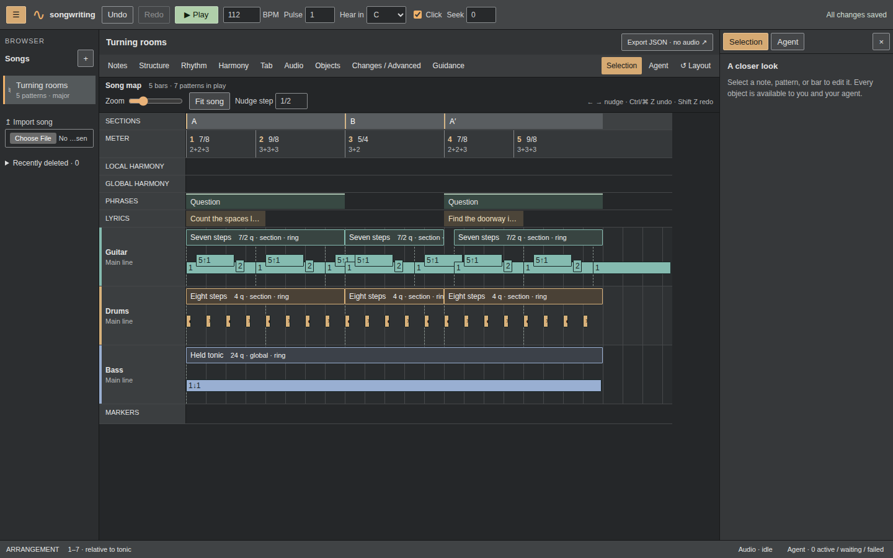
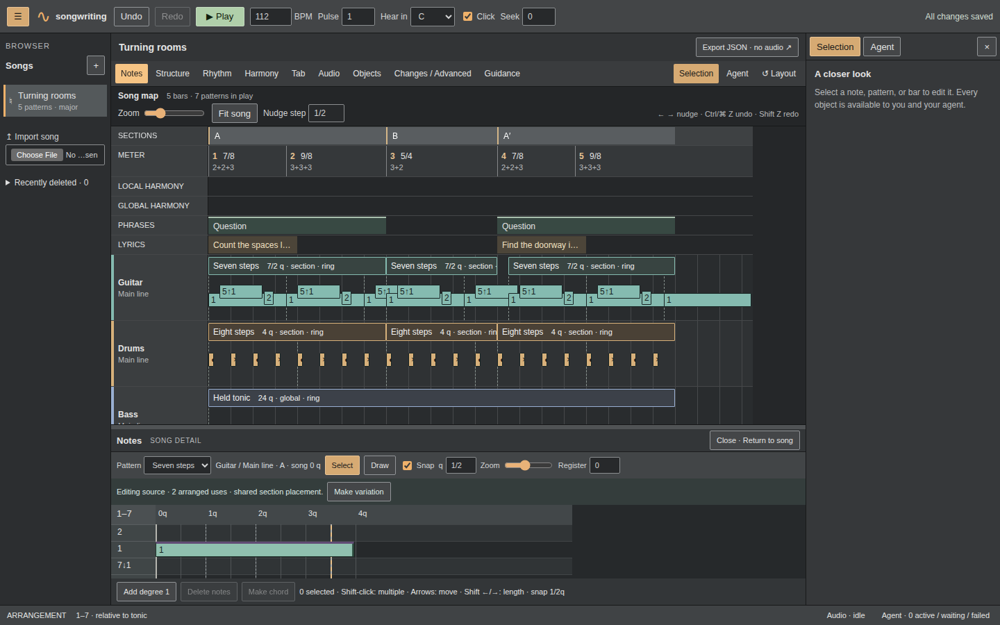

# Arrangement workspace and relative-degree editor

Implemented 2026-09-08 on `codex/arrangement-workspace`, from
[the refined redesign plan](../UI_REDESIGN_PLAN.md). This is the selected desktop
workspace portion of Phase 8. Offline/PWA work, a mobile release, and Phase 9
remain separate.

## Delivered

| Before | After | Why |
| --- | --- | --- |
| Stacked workbenches above the music | Persistent transport and arrangement, named tool tray, optional side panels | The song is visible immediately |
| Green cards, large spacing, small music labels | Flat grey panels, compact controls, part colours, numeric timing and readable labels | The requested Ableton-inspired arrangement feel |
| Property fields for relative notes | Integrated 1–7 degree grid with explicit alterations and octave bands | Write pitched music visually without tying it to an audition key |
| Whole-page redraw work on selection | Cached song geometry and retained inactive workbenches | Faster selection in dense arrangements without discarding drafts |

The implementation covers R1–R5 of the plan and R6's automated checks. Notes
support drawing, exact fraction fields, multi-selection, move/resize, keyboard
nudges, Escape cancellation, deletion, explicit chord grouping, and independent
member attack/release edits. Alterations keep their spelling; changing the
playback tonic leaves stored degrees unchanged. Source scope and shared usages
are visible. Pattern variation clones chords and notes and can retarget the
selected placement; Structure's section variation remains the action for changing
one appearance of a repeated section.

Musical edits use existing revision-checked mutations and receipts. A pointer
gesture captures its base revision and commits once. Failed proposals remain
copyable; exact-field and JSON drafts survive tool switches and foreign changes.
Existing recording, media, fretting, lyrics, harmony and agent workflows stay on
their existing controllers and command paths. No song-schema migration or new
runtime dependency was introduced.

Implementation seams: `workspace-layout`, `song-map`, `transport`, `song-library`,
`note-editor`, `note-grid`, `note-fields`, and pure `song/note-edit` helpers. The
capability map documents how agents compose the same edits with primitives.

## Verification

- `bun run verify`: **PASS**, 86 unit tests / 547 assertions, typecheck and Vite
  production build. Five new musical tests cover exact snapping, octave motion,
  independent chord releases, member deletion, explicit grouping and undo.
- `bun run test:browser`: **PASS**, all 32 workflows in the final complete run
  (3.4 minutes on this droplet). The new six editor workflows cover numeric pitch,
  exact-time gestures, variations, conflicts, draft retention and responsive layout.
- `git diff --check`: **PASS**.
- GitHub repeats typecheck, unit tests, production build and all 32 browser
  workflows on the pull request. Merge is gated on that verification; the PR
  provides the authoritative commit and run links.

The existing browser tests were updated to open the appropriate named workbench;
all prior music, media, conflict, retry and task assertions remain. The navigation
test now zooms in before expecting a jump to scroll: the wider workspace can fit
the entire acceptance song without scrolling. GitHub also exposed a test reading
a newly drawn note before its async save completed. A 150 ms injected save delay
reproduced that exact undefined-ID failure locally; the test now waits for the
saved event before testing subsequent gestures, and keeps the delay as regression
coverage.

Browser checks cover 1440×900, 1366×768, 1024×768, 390×844 and 720×450
(the CSS viewport equivalent of 1440×900 at 200% browser zoom). Opening/closing tools
and resizing do not dirty the song. The browser collapses when crossing into a
compact layout, and the note editor has an explicit Return to song action. The
tray resize separator supports arrow keys, Home and End. Repeated composition
interactions have no decorative animation; reduced-motion styling is explicit.
Measured palette contrast: body text 10.62:1, muted text 5.00:1, note text 7.87:1,
selected note text 9.49:1, button borders 3.15:1, input borders 4.43:1, and the
focus colour against the control surface 6.92:1. This is a palette check plus
keyboard/browser workflows, not a comprehensive screen-reader audit.

The media regression uses Chromium's synthetic microphone. Agent regression
uses the real local bridge with scripted tool requests; no new live-model or
physical microphone evaluation is claimed for this layout change.

## Dense-song measurement

Reproduce with the dev server running: `bun scripts/measure-workspace.ts`.
The fixture has 16 parts, 64 placements and 5,000 rendered notes. Samples below
were taken in headless Chromium 153 on this Linux droplet against the Vite dev
build; they are measurements, not a production performance guarantee.

| Measurement | Before redraw optimisation | After |
| --- | --- | --- |
| Selection to next animation frame, 12 samples | 89–208 ms | 22–141 ms; most samples 45–86 ms |
| Panning frames, 20 samples | 3–31 ms | 8–21 ms |

Caching removed repeated geometry and inactive-workbench rendering from ordinary
selection. One measured selection frame still exceeded the 100 ms target. Further
profiling on actual writing devices is warranted; no repeated >50 ms panning
frames occurred in this sample.

## Limits

- Desktop and compact Chromium layouts are checked; physical touch devices,
  Safari/Firefox and offline/mobile-release behaviour are not certified here.
- Seven degree lanes repeat by octave. Present alterations get labelled sublanes;
  the editor scrolls vertically rather than shrinking text to fit every octave.
- Snap uses exact fractions. With snap disabled, pointer positions resolve to
  1/960 quarter notes; exact fields allow other fractions. Extremely dense snap
  grids omit subdivision lines beyond 1,024 guides without rounding stored time.
- Other voices are ghost context, capped at 512 notes with an explicit count;
  the main arrangement retains the complete music. Audio remains a recorded take,
  and drums retain named hits rather than being assigned invented degrees.
- Panel geometry is saved locally. Dirty drafts and failed gesture proposals are
  retained for the current app session; saved music and operation receipts retain
  their existing durable storage. This does not add durable unsaved-form recovery.
- There is no Session/clip launcher, audio warping or new loop/mixer model.
